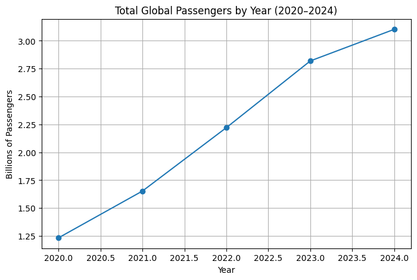
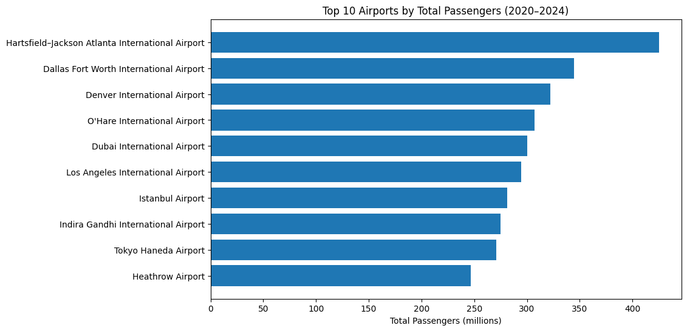
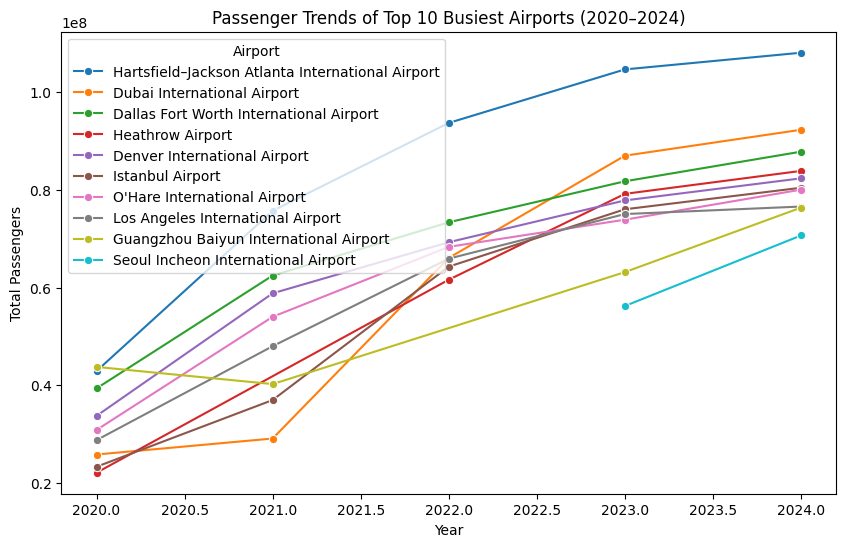
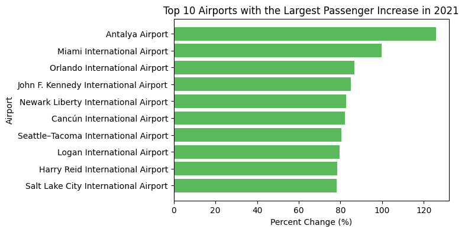
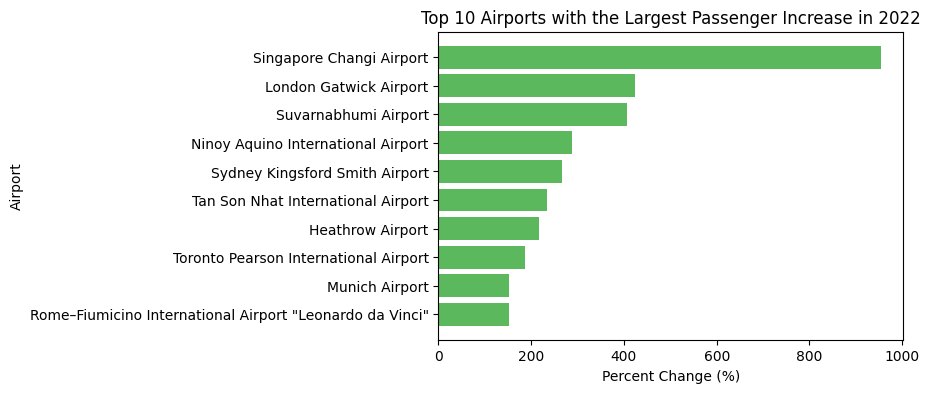

# Introduction
The world’s busiest airports over the years is a fascinating topic to dive into. Travel is becoming more popular each year, so I thought it would be interesting to dive into which airports have the most passengers flying through them. Airports Council International (ACI) publishes yearly reports ranking the world’s airports. This dataset provides valuable  information about which airports are the busiest, along with which airports are growing the fastest. It will provide a great opportunity to visualize global trends and identify the regions that are growing the fastest in air travel. 

The COVID-19 pandemic greatly disrupted global air travel. There was a huge decrease in 2020. Since then, air travel has increased. How fast airports increased their travel since 2020 will also be interesting to investigate. 

This project is relevant because it combines real-world data from multiple years, helps practice web scraping and data cleaning in Python, and uses exploratory data analysis (EDA) to answer practical questions about global air travel. 

# Motivating Questions 

- Which countries and airports consistently handle the most passengers from **2020–2024**?
- Which countries and airports have **recovered the quickest** after the COVID-19 pandemic?

# Ethical Data Collection
All data used in this project was obtained from Wikipedia, a public, freely available online resource. Because the pages were publicly accessible and did not require any login or API key, collecting data with pd.read_html() was ethical and consistent with good web scraping practices. 

I followed these best practices to get the data:

- I used a custom user-agent header that identified me as a BYU student using my BYU email. 
- I only requested the data once, therefore not overloading Wikipedia’s servers. 
- Ensured data collection was transparent and reproducible.

All of these practices ensured that my data collection followed proper ethical research standards and web scraping techniques. 


# How to get the Data
To gather my data, I scraped publicly available data from Wikipedia. The page is called, “List of Busiest Airports by Passenger Traffic.” This webpage has separate tables for each year starting in 2020 until 2024. I chose to get all of this data to investigate which airports are the busiest and which airports bounced back from the COVID-19 pandemic the fastest. 

These are the steps that I took to get this data - and how you can collect it yourself!

### 1. Set up your environment and install your packages 
Install and import the necessary Python packages.

```{python}
import pandas as pd
import requests
```

### 2. Find your source page 
I found my data all on one page in Wikipedia: 

- [Wikipedia: List of Busiest Airports by Passenger Traffic](https://en.wikipedia.org/wiki/List_of_busiest_airports_by_passenger_traffic)

### 3. Make a request for the data and Extract the Tables

- I included a custom user-agent string with my BYU email 
- Then you use requests.get to get the data!
- Use raise_for_status checks to check if you got any errors getting your data

```{python}
email = "rasbands@byu.edu"
ua = f"STAT386-class-scraper/1.0 (+{email})"

url = "https://en.wikipedia.org/wiki/List_of_busiest_airports_by_passenger_traffic"
r = requests.get(url, headers={"User-Agent": ua, "From": email}, timeout=15)
r.raise_for_status()

tables = pd.read_html(r.text)
```

### 4. Loop through each year’s table, add a year column, & concatenate them into one dataset

First, define the years you want to include and create an empty list to store each table. Then, loop through the tables, add a Year column, and concatenate everything together:

```{python}
years = [2024, 2023, 2022, 2021, 2020]
all_airports = []
for i, year in enumerate(years):
   df = tables[i].copy()
   df["Year"] = year
   all_airports.append(df)


data = pd.concat(all_airports, ignore_index=True) 
```


### 5. Clean and save your dataset! 

Perform basic cleaning and save your final CSV file.

In general, if you want to do a similar project, find a webpage with structured tables, confirm that they can be read by pd.read_html(), add identifying info (like year or category), and then merge and clean your tables! 


# Explanatory Data Analysis (EDA) 
Before jumping into the analysis, I first did a quick look at  the data to understand what it looks like.

- There are 250 observations - 50 observations for years 2020-2024
- There are 9 total variables: Rank, airport, location, country, code, total passengers, rank change, percent change, and year. 
- Years range from 2020 to 2024, which captures the pandemic and the recovery period after. 

Here are a few interesting findings from numerical summaries of the numeric variables:

- The average number of passengers across the 250 airports was ~44 million, with the busiest airport reaching over 108 million passengers.
- The percent change varies widely — from -15% decline to nearly +955% growth, suggesting a mix of recovery and rapid growth likely due to post-COVID rebounds.

Here is a graph showing how the number of passengers riding airplanes has significantly increased over the past 5 years since COVID-19. 



After running some initial checks on the data and summary statistics, I dived deeper into the data and dived more into my questions of interest. 

#### Which countries and airports consistently handle the most passengers from **2020–2024**?

Here is a graph showing the top 10 airports overall since 2020:



We can see that Harsfield-Jackson Atlanta International Airport has had the most passengers over the last 5 years. It's average total passengers per year is 85,008,858. This is almost 20 million more than the next highest airport - Dallas Fort Worth International Airport. It is also interesting that the top 3 airports are in the United States. 

To better understand which airports are the most consistent and how countries compare, the table below shows the average passengers per airport from 2020–2024, along with total passengers and how many years each appeared in the top 50 list.

| Airport | Avg. Passengers | Total Passengers | Years in Top 50 | Country |
|----------|----------------|------------------|------------------|----------|
| Hartsfield–Jackson Atlanta Intl | 85,008,858 | 425,044,292 | 5 | United States |
| Dallas Fort Worth Intl | 68,953,419 | 344,767,094 | 5 | United States |
| Denver Intl | 64,410,561 | 322,052,803 | 5 | United States |
| Seoul Incheon Intl | 63,452,329 | 126,904,658 | 2 | South Korea |
| Heathrow | 61,697,870 | 246,791,481 | 4 | United Kingdom |
| O’Hare Intl | 61,431,709 | 307,158,545 | 5 | United States |
| Dubai Intl | 60,062,345 | 300,311,726 | 5 | United Arab Emirates |
| Los Angeles Intl | 58,869,993 | 294,349,964 | 5 | United States |
| Istanbul | 56,213,228 | 281,066,142 | 5 | Turkey |
| Guangzhou Baiyun Intl | 55,887,793 | 223,551,173 | 4 | China |

From this summary, we can see that **Atlanta (ATL)** clearly stands out as the busiest airport in the world, averaging over **85 million passengers per year** between 2020 and 2024. The United States dominates the rankings, with **six airports** represented. These airports also consistently appeared in the top 50 every year, showing how strong the U.S. air travel network is. Outside of the U.S., **Dubai, Istanbul, Heathrow,** and **Guangzhou** are the most consistent international hubs. 

Interestingly, **Seoul Incheon International Airport** only appears twice in the top 50 during the years 2020-2024. While looking into the data further, Seoul appeared in 2023 and 2024. This is likely due to the strong COVID-19 shutdowns in Asia. 

For more context about these airports over time, you can see this graph that shows the top 10 busiest aiports overall displayed over time:



From this graph, we can clearly see again that Atlanta is significantly higher than all the other airports each year. We can also see how air travel is increasing each year for most of these big airports. Dubai had the biggest jump in passengers from 2021 to 2022, due to opening back up to travelers after Covid. From our discussion above about Seoul, we can also see that this airport appears in the top 50 in 2023 and stays for the year of 2024. 


#### Which countries and airports have **recovered the quickest** after the COVID-19 pandemic?

To analyze this question, I looked at year-over-year percent change in passengers using the 'PercentChangeSigned' column. The results show patterns in geography and timing.

During 2021, most of the fastest-recovering airports were located in the U.S. 



By 2022, the pattern shifted. The strongest growth rates were across Asia and Europe, as international borders opened back up again. Singapore was the airport that grew the most this year. You can also see that these year-over-year changes are extremely higher than what we saw in 2021. 



Overall, this data shows that the U.S. recovered first in 2021. After that, Asia and Europe rebounded explosively as international travel resumed. The speed of how quick airports opened back up for travel varied across regions. 

# Further Information/Resources

- [Wikipedia: List of Busiest Airports by Passenger Traffic](https://en.wikipedia.org/wiki/List_of_busiest_airports_by_passenger_traffic)
- [Pandas User Guide](https://pandas.pydata.org/docs/user_guide/index.html)

# Link to Code 
You can find my full project code here! 

[Github Repository Link](https://github.com/Sammi02/Data-Acquisition-Blog )
